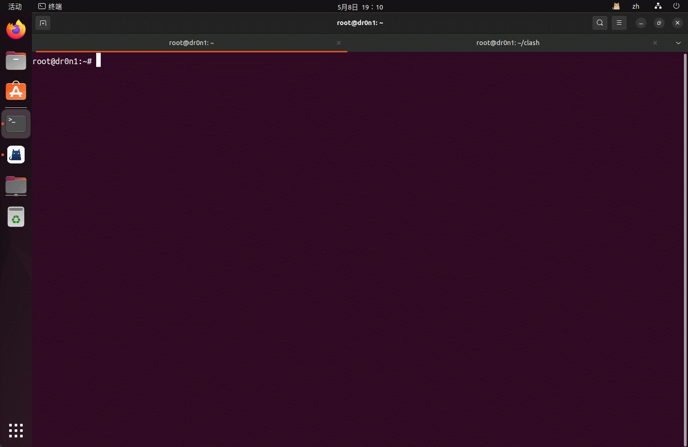

# CTF_Tools_Auto_Deploy

一个自动安装 CTF Misc/Pwn/Web 常用工具的~~轻量~~sh 脚本  
适合在新虚拟机中快速安装工具

# 目前支持的功能

1：基础功能（换网络源，允许 root ssh 登录等）  
2：安装 docker / docker-compose  
3：安装 golang  
4：安装 java  
5：安装 linux 下的部分 pwn 工具  
6：安装 linux 下的部分 misc 工具和第三方脚本  
7：安装 linux 下的部分 web 工具和第三方脚本

具体如下，标注**docker**的以容器的形式部署，标注**file**的以文件的形式保存在目录中，其他默认以**命令**的形式安装

```text
misc:
binwalk
bkcrack(file)
blindwatermark(file)
blind-watermark
cloacked-pixel(file)
dtmf2num
dwarf2json(file)
exif
extundelete
f5-steganography(file)
foremost
gaps
gnuplot
identify
minimodem
montage
outguess
pycdc(file)
sstv
steghide
stegosaurus
stegpy
stegseek
usb-mouse-pcap-visualizer(file)
usbkeyboarddatahacker(file)
volatility2(file)
volatility3(file)
webp
wireshark
zsteg
crc32(file)
CyberChef(docker)

pwn:
pwntools
ropper
one_gadget
pwndbg
gef
seccomp-tools
qemu

web:
reverse-shell-generator(docker)
gtfobins(docker)
neo-regorg(file)
stowaway(file)
frp(file)
iox(file)
chisel(file)
PHP_INCLUDE_TO_SHELL_CHAR_DICT(file)
cnext-exploits(file)
php_filter_chains_oracle_exploit(file)
php_filter_chain_generator(file)
Gopherus
c-jwt-cracker(docker)
rsa_sign2n(file)
```

# 支持的系统

已在 ubuntu 20.04.6/22.04.5/24.04.2 中完成测试

**部分**功能需要配合代理使用

# 使用

本脚本可重复运行安装  
工具保存在运行脚本的`misc_tools`,`pwn_tools`和`web_tools`目录下

方法一：  
git clone https://github.com/dr0n1/CTF_misc_auto_deploy  
chmod +x auto_deploy.sh  
./auto_deploy.sh [mode]

```shell
usage: ./auto_deploy.sh [mode]
                base                            基础配置
                docker                          安装docker
                docker-compose                  安装docker-compose
                go                              安装golang
                java                            安装java
                misctools                       安装misc工具
                pwntools                        安装pwn工具
                webtools                        安装web工具

示例: ./auto_deploy.sh base docker
```

方法二：  
bash <(curl -s https://raw.githubusercontent.com/dr0n1/CTF_misc_auto_deploy/main/auto_deploy.sh) [mode]




---

本项目仅用作学习教育目的, 不用于任何其他用途, 如有侵权请第一时间联系作者删除

This project is only for learning and educational purposes and is not intended for any other purpose. If there is any infringement, please contact the author immediately to delete it
